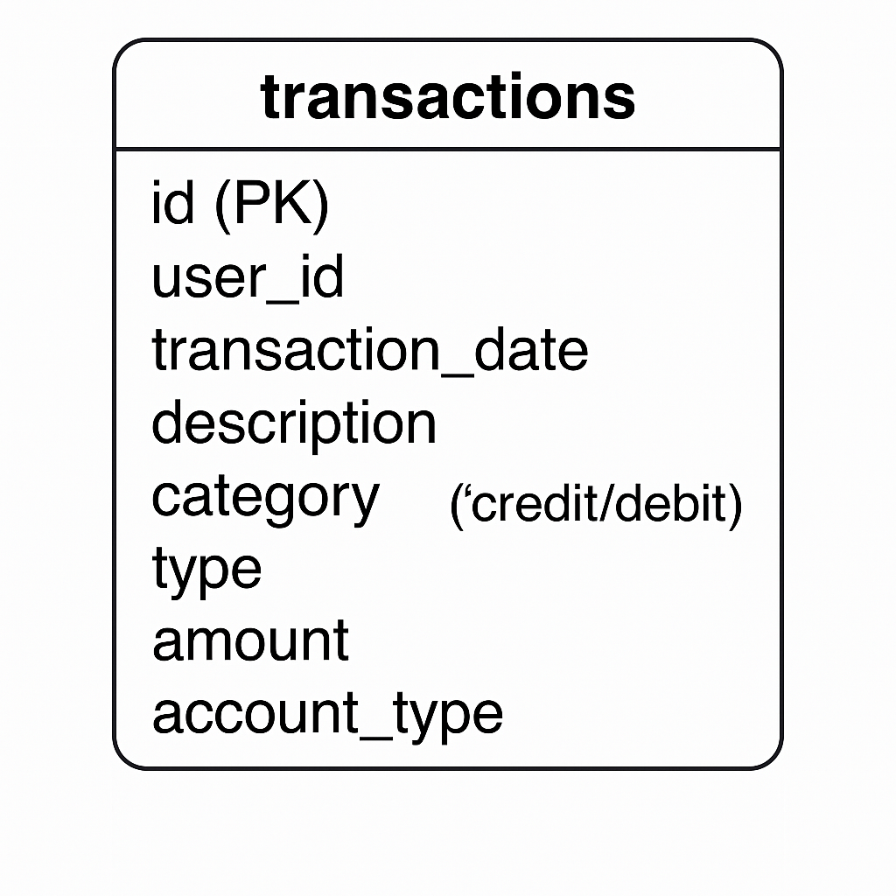

# Personal Finance SQL Analysis

## Overview

This project simulates a personal finance dashboard by analyzing user transaction data with SQL. It covers spending patterns, income vs. expenses, savings rate, and recurring costs. Ideal for showcasing SQL skills in the context of finance and real-world analytics.

## Goals

- Track monthly income, expenses, and savings
- Identify recurring expenses (subscriptions, bills)
- Calculate savings rate over time
- Provide insights into spending behavior by category

## Dataset

The dataset is synthetic and modeled after a typical bank transaction ledger. It includes:

- `transaction_date`: Date of each transaction
- `category`: e.g., Rent, Food, Utilities, Income
- `type`: 'credit' (income) or 'debit' (expense)
- `amount`: Transaction value
- `account_type`: e.g., Checking, Savings, Credit Card

## Folder Structure

personal-finance-sql-analysis/
│
├── data/
│   └── create_tables.sql
│   └── sample_data.sql
│
├── sql/
│   ├── monthly_spending.sql
│   ├── income_vs_expenses.sql
│   ├── recurring_expenses.sql
│   ├── savings_rate.sql
│   └── views_functions.sql
│
├── README.md
└── schema.png

## Key SQL Concepts Used

- Joins
- Aggregations (SUM, COUNT)
- Window functions
- CTEs
- Conditional aggregation (`CASE` statements)
- Date truncation

## Example Insights

- **January 2024**:
  - Income: $3,800.00
  - Expenses: $1,516.74
  - Savings: $2,283.26 (60.08% savings rate)

- Top recurring expense: Netflix Subscription ($15.99/month)

## Tools

- PostgreSQL / SQLite
- DB Browser for SQLite or pgAdmin
- (Optional) Tableau or Power BI for dashboards

## Setup Instructions

See [Setup Instructions](#setup-instructions) below to run this in your local environment.

## ER Diagram

## Setup Instructions

### Option 1: SQLite

1. Download [DB Browser for SQLite](https://sqlitebrowser.org/).
2. Create a new database.
3. Run `create_tables.sql`, then `sample_data.sql`.
4. Run queries from the `/sql` folder.

### Option 2: PostgreSQL (Recommended)

1. Install PostgreSQL and pgAdmin.
2. Create a new database (e.g., `personal_finance`).
3. Open pgAdmin and run:
   - `create_tables.sql`
   - `sample_data.sql`
4. Run queries from the `/sql` folder.

---

## License

MIT License. Feel free to use, modify, and extend this project.

## Contact

Built by Betty Oware — [LinkedIn](https://www.linkedin.com/in/bettyoware/) | [Email](mailto:bettyoware@outook.com)
